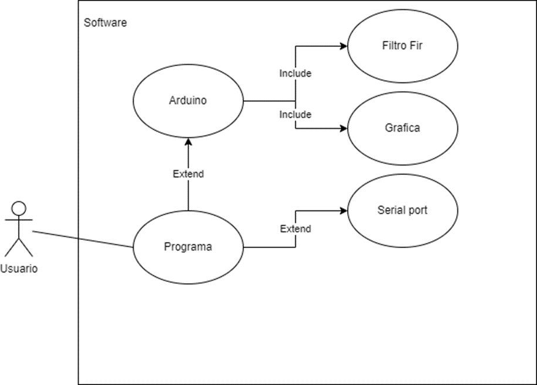
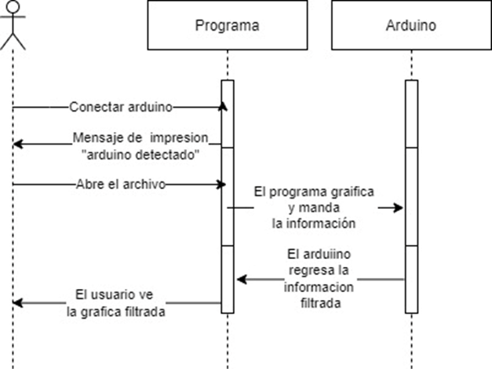
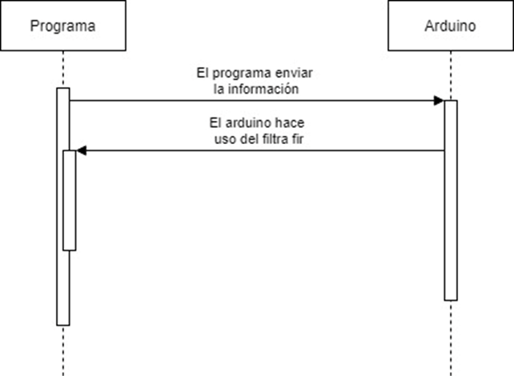
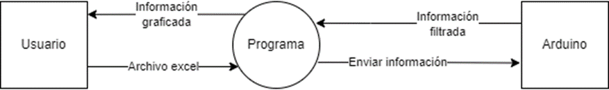
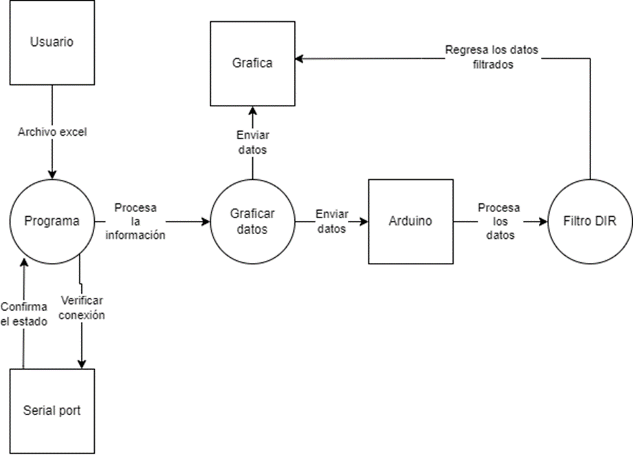
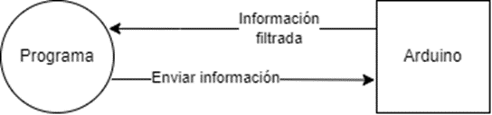

# Proyecto: NeuroFilter

**NeuroFilter** busca llevar a cabo el filtrado electrónico de señales EEG obtenidas de 
mediciones en algunos pacientes. Primeramente, los datos que se encuentran en 
un libro de Excel serán transmitidos de forma inalámbrica a un filtro diseñado e 
implementado en un microcontrolador en el entorno de desarrollo Arduino. El 
microcontrolador será programado usando C y los procesos de comunicación entre 
el Arduino y la PC serán programado en Python. 

[Manual formato md](docs/manual.md)

[Manual pdf](manual.pdf)

## Casos de uso

## Diagramas de secuecias

## Diagramas de flujo de datos

### Diagrama de Nivel superior(Nivel 1)

### Diagrama de Contexto(Nivel 1)

## Build

Para hacer build de este proyecto debes tener :

- Pycharm
- arduino ide

1. Debes cargar el archivo .ino mediante arduino ide.

2. Debes ir al archivo main.py y ejecutar el archivo.

