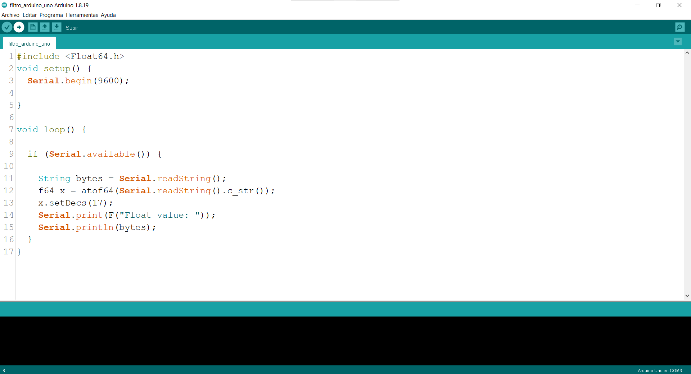
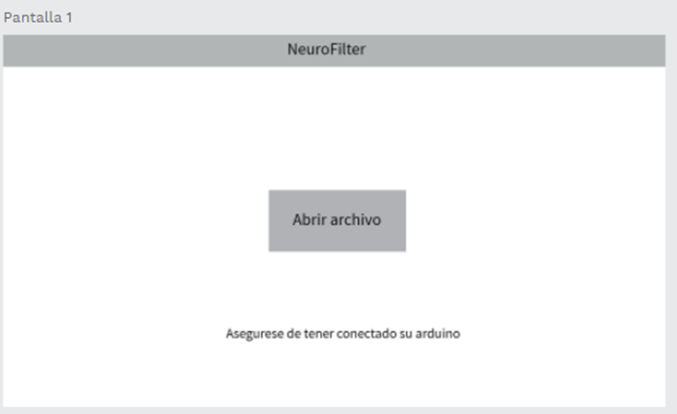
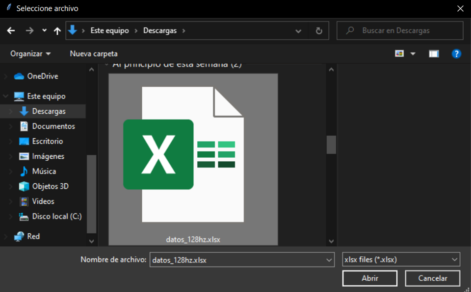
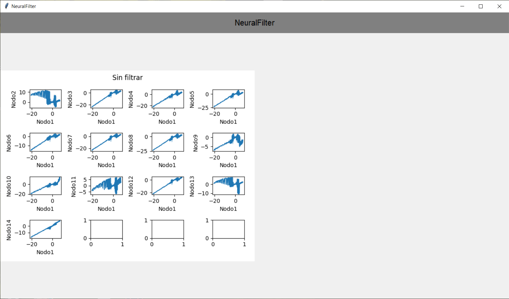

## Arduino
Lo primero que tenemos que hacer es cargar el archivo en nuestro arduino 
para esto debemos tener instalado arduino ide.

Una vez instalado, se debe abrir el archivo y dar en la opcion de cargar archivo

Despues podemos cerrar el programa.

## NeuralFilter
La interfaz de programa constaría de dos pantallas, esta sería la primera pantalla donde 
se pregunta al usuario sobre el archivo Excel que va filtrar.

El usuario deberá buscar el archivo y el programa enviará los datos a Arduino

Despues Saldra una ventana con los datos graficados.

